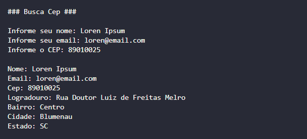
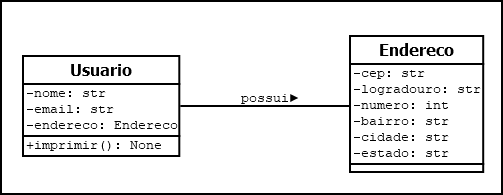

# Buscar Cep com Python

### Python

## Diagrama de classe

## Objetivo

Desenvolver uma aplicação em Python utilizando Orientação a Objetos para cadastro de usuários e endereços. Integrar consumo de API para busca automática de informações via CEP. Implementar tratamento de exceções para validação e maior robustez da aplicação.

## Finalidade

- Cadastro de usuários e endereços
- Consulta automática de CEP via API
- Organização do código com Orientação a Objetos
- Validação e tratamento de erros
- Exibição estruturada dos dados do usuário

## O quê foi usado?

- Linguagem Python
- Programação Orientada a Objetos (POO)
- Biblioteca `requests`
- Consumo de API REST (BrasilAPI)
- Classes e objetos (`Usuario` e `Endereco`)
- Tratamento de exceções (`try/except`)
- Entrada e saída de dados pelo terminal

## Stat Aplicação

- Abrir pasta no terminal `cd app`
- Executar aplicação `python3 run.py`

## Contatos
- E-mail: [kba.2879@gmail.com](mailTo:kba.2879@gmail.com)
- Linkedin: [/katarine-albuquerque](https://www.linkedin.com/in/katarine-albuquerque/)
